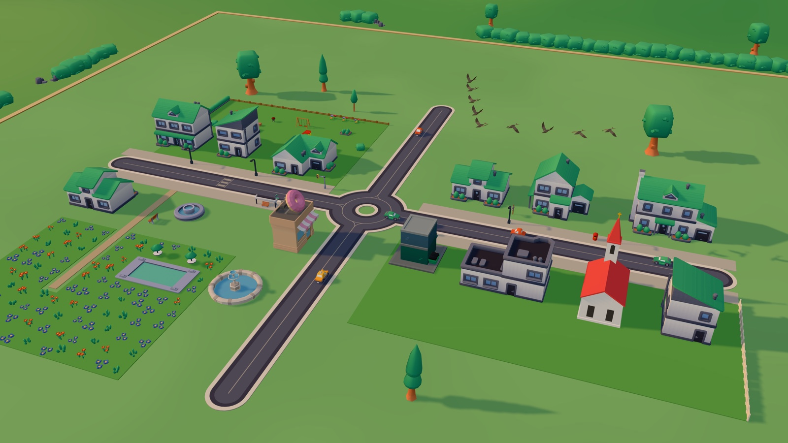
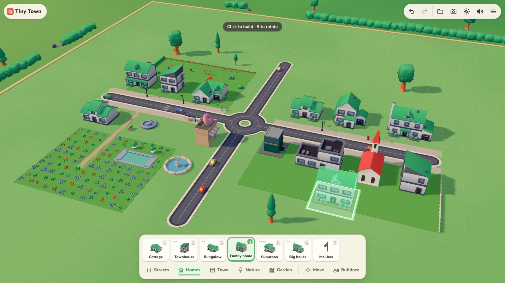
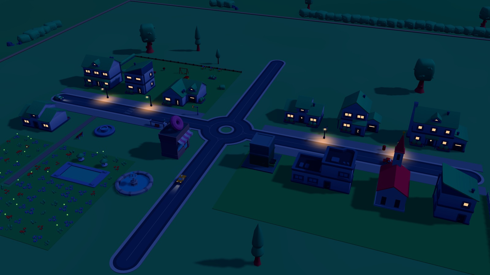

# Tiny Town

**Build your own cosy dream town.**



Tiny Town is a cosy city-builder sandbox that runs in your browser. There are no goals, money or timers. You lay roads, put down houses, shops and gardens, and watch the town come to life as cars drive by, birds fly over and the windows light up at dusk.

## What you can do

- **Lay streets.** Drag roads that join up on their own, add pavements, roundabouts, zebra crossings and traffic lights.
- **Build homes and a town centre.** Cottages, townhouses, bungalows, family homes and big houses, plus a corner shop, donut shop, supermarket, church, bus stop and tiered fountain. Several items come in more than one style.
- **Plant nature and gardens.** Lawns, wildflower meadows, tulips, oaks, pines and birches, hedges and fences, benches, a barbecue, swings, a slide and a pool.
- **Move things around** and undo or redo any change. Your town saves itself as you build.
- **Watch day turn into night.** Let the clock run, or pick Day or Night. At night the windows glow, the street lamps come on, cars switch on their headlights and fireflies drift over the meadows.
- **Watch the town move.** Cars drive the roads, and every so often a flock of pigeons, starlings, gulls or geese crosses the sky.
- **Name your town**, then **take a photo** of it as a Polaroid-style JPEG.
- **Download your town** as a `.tinytown.json` file and open it again in any browser.
- **Pick a graphics preset** (Low, Medium or High) to suit your device.
- **Play with a mouse or by touch.** The controls work on phones and tablets as well as desktops.





## Controls

| Mouse & keys | |
|---|---|
| Click · drag | Build with the selected tool |
| Right-drag · WASD | Move the camera |
| Middle-drag · Q / E | Turn the camera |
| Wheel · + / − | Zoom |
| 1–9 · Shift + 1–5 | Pick an item · switch category |
| R · V | Rotate · next style |
| M · B | Move · Bulldoze |
| Ctrl+Z · Ctrl+Shift+Z | Undo · redo |
| F | Reset the view |
| T · P | Time of day · take a photo |
| Esc · ? | Put the tool away / menu · help |

**Touch:** tap or drag to build; use two fingers to move the camera, twist to turn it and pinch to zoom. With no tool selected, a one-finger drag also moves the camera.

The full list is in the game under Menu → Help → Controls.

## Run it locally

You need Node.js 20.19+ or 22.12+ (Vite's requirement).

```bash
npm install
npm run dev        # http://127.0.0.1:5188
npm run build      # production build in dist/
npm run preview    # serve the build
```

`npm run verify` runs the repo checks (no local paths, up-to-date licence list), the type check, unit tests and production build. `npm test` also runs the Playwright end-to-end tests, which need a Chromium download first (`npx playwright install chromium`).

**Tech:** [three.js](https://threejs.org), TypeScript and Vite, tested with Vitest and Playwright.

**For developers:** [architecture](docs/architecture.md) · [design](docs/design.md) · [assets](docs/assets.md) · [release](docs/release.md)

## Credits

The 3D models and sound effects are mostly from [Kenney](https://kenney.nl)'s CC0 kits, six models are CC-BY 3.0 from [Poly Pizza](https://poly.pizza), and the font is [Nunito](https://fonts.google.com/specimen/Nunito) (SIL Open Font License). The full list, with licences and attributions, is in [CREDITS.md](CREDITS.md).

## Author

Made by Nazarii Taran: [GitHub](https://github.com/nazariitaran/tiny-town-threejs-game) · [LinkedIn](https://www.linkedin.com/in/nazariitaran) · [X](https://x.com/tn255)

## Licence

<!-- TODO: licence -->
