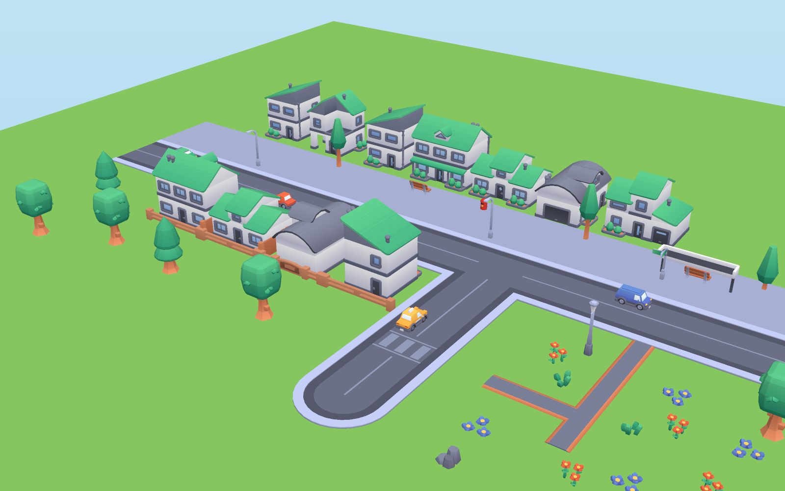
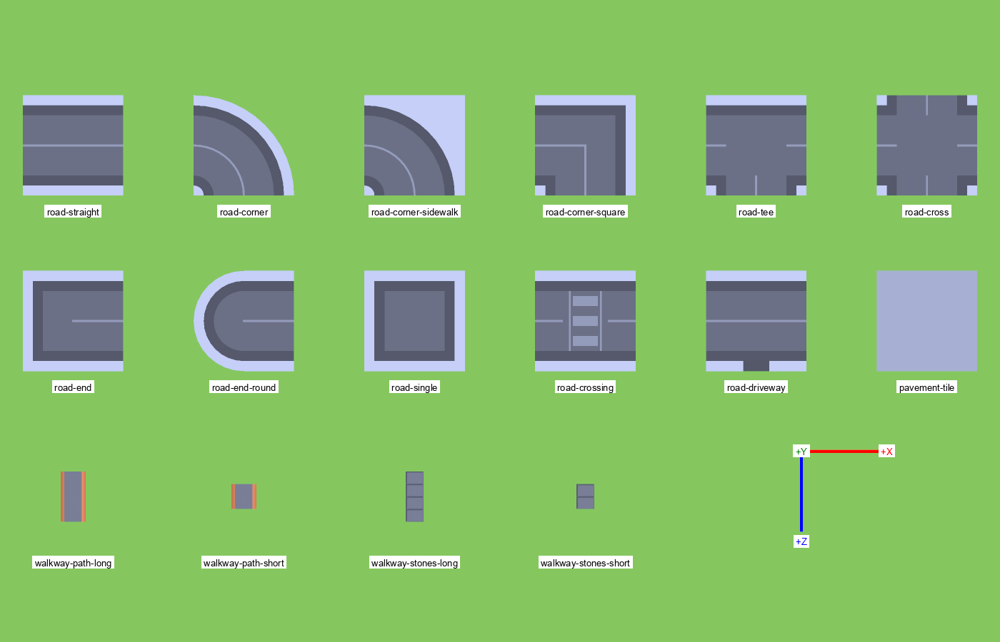

# 3D models — Tiny Town

Every placeable item is covered by **CC0** models, almost all from Kenney's current kits, which share one flat, colourful look: a 512 px gradient `colormap.png` per kit, the same greens, lavender-greys and terracotta. Nothing here is CC-BY.

- Machine-readable manifest: [`models.json`](models.json). It has 44 entries with bounds, pivot, front, scale, footprint, triangle count and bytes.
- Re-measure and verify: `npm run inspect:models`, or add `--three` to also load every GLB through three.js `GLTFLoader`.
- Rebuild the composed models: `node scripts/compose-models.mjs`. The sources live in `assets-src/` and are gitignored.
- Screenshots: [town preview](models-town-preview.png), [gallery of all 44 at suggested scale](models-gallery.png), [road pieces top-down](models-road-pieces-topdown.png).
- Payload: **2.08 MB** of GLB + PNG in `public/assets/models/`, plus 74 KB of icons. The cars are 0.73 MB of that and are optional.

## Coverage per build tool

| Tool | Model id(s) in `models.json` | Source file | Scale | Footprint |
| --- | --- | --- | --- | --- |
| Road | `road-straight`, `road-corner` (curved), `road-corner-sidewalk`, `road-corner-square`, `road-tee`, `road-cross`, `road-end`, `road-end-round`, `road-single`; optional `road-crossing`, `road-driveway` | `roads/*.glb` (City Kit Roads) | 1 | 1×1 |
| Pavement | `pavement-tile` | `roads/tile-low.glb` | 1 | 1×1 |
| Walkway | `walkway-path-long` (arm), `walkway-path-short` (hub); stepping-stone variants `walkway-stones-*` | `suburban/path-*.glb` | 1.25 | 1×1 (see below) |
| Grass | `grass-tuft` (scatter) + a flat ground tile | `platformer/grass.glb` | 0.35 | scatter |
| Wildflower meadow | `meadow-flowers`, `meadow-flowers-tall` (+ `grass-tuft`) | `platformer/flowers*.glb` | 0.35 | scatter 3–6 per cell |
| Tree ×3 | `tree-a` round "Oak", `tree-b` "Pine", `tree-c` slim "Birch"/tall (+ `tree-c-small`) | `platformer/tree.glb`, `platformer/tree-pine.glb`, `suburban/tree-large.glb` | 0.36 / 0.36 / 1 | 1×1 |
| Townhouse ×3 | `townhouse-a` cottage (type-a), `townhouse-b` narrow townhouse (type-k), `townhouse-c` family home (type-e); optional `townhouse-b-alt` (type-r), `townhouse-c-alt` (type-c) | `suburban/building-type-*.glb` | 0.75 | 1×1 |
| Garage | `garage`: single garage, industrial building-j re-centred; optional `garage-row`: 2×1 lock-up block | `composed/garage.glb`, `industrial/building-s.glb` | 0.75 | 1×1 / 2×1 |
| Bus stop | `bus-stop`: canopy, bench and sign, **composed from Kenney parts** | `composed/bus-stop.glb` | 1 | 1×1 |
| Tall fence | `fence-tall`: edge piece built from 2× suburban fence panels | `composed/fence-tall.glb` | 1 | cell edge |
| Small fence | `fence-small`, optional `fence-small-gate`: Fantasy Town fence re-oriented to the edge convention | `composed/fence-small*.glb` | 1 | cell edge |
| Postbox | `postbox`: **procedural red pillar box**, because no CC0 match exists in this style | `composed/postbox.glb` | 1 | 1×1 |
| Lamppost | `lamppost` (City Kit Roads `light-curved`); optional `lamppost-classic` (Fantasy Town lantern) | `roads/light-curved.glb`, `fantasy-town/lantern.glb` | 0.9 / 0.4 | 1×1 |
| Extras | `car-sedan`, `car-hatchback`, `car-van`, `car-taxi`, `bench`, `rocks`, `bush` | `cars/*`, `holiday/bench`, `platformer/rocks`, `platformer/plant` | 0.14 / 0.26 / 0.3 / 0.45 | — |

Every entry has a 64×64 toolbar icon at `/assets/icons/<id>.png`. Most are Kenney's own preview renders; `bus-stop` and `postbox` were rendered here in the same angle and style. `garage` reuses the industrial `building-j` preview, `fence-tall` the suburban `fence` preview, and `fence-small`/`fence-small-gate` the Fantasy Town previews, because they are the same meshes.

The suburban houses can change roof colour. `suburban/Textures/variation-{a,b,c}.png` have the same layout as `colormap.png`: roof swatch orange, pink or dark instead of green. To use one, load it with `TextureLoader`, set `flipY = false` and `colorSpace = SRGBColorSpace`, and assign it as `material.map` on a **cloned** material.

## Grid and scale

**`CELL_SIZE = 1` world unit = one Kenney road tile.** All road and pavement pieces are exactly 1×1 at scale 1, centred, with their top at y = 0.02. The other kits use other native scales, so each model has its own scale factor, chosen so that everything sits sensibly on the 1-unit grid:

| Group | Scale | Resulting size (w × h × d) | Why |
| --- | --- | --- | --- |
| Roads, pavement | 1 | 1 × 0.02 × 1 | Defines the grid. Two lanes of ≈0.37 each between kerbs. |
| Suburban houses, garage | **0.75** (one value for all) | 0.69–0.98 wide, 0.63–0.86 tall, ≈0.77 deep | The widest chosen house (1.3 native) fits one cell with a small front yard. One shared value keeps storeys and doors the same height across types. |
| `garage-row` | 0.75 | 1.59 × 0.63 × 0.69 | 2×1 footprint |
| Platformer trees | 0.36 | ≈0.4 wide, 0.70–0.72 tall | About house height |
| Suburban `tree-large`/`-small` | 1 | 0.21 wide, 0.77/0.57 tall | Already at city scale |
| Flowers / grass tufts | 0.35 | 0.1–0.27 clumps | Scatter several per cell |
| Walkway paths | 1.25 | arm 0.25 × 0.5, hub 0.25 × 0.25 | An arm reaches exactly from the cell centre to an edge |
| Composed items (bus stop, fences, postbox) | 1 | see the notes in `models.json` | Authored directly in world units |
| Lamppost `light-curved` | 0.9 | 0.61 tall, arm reaches 0.18 | Lower than the eaves |
| Cars | 0.14 | 0.21 × 0.18 × 0.36 | Fits one lane |
| Bench | 0.26 | 0.29 × 0.19 × 0.16 | Matches the bench inside the bus stop |

Small props (postbox, bench, lamppost) are roughly 1.5–2× their real size relative to the houses. That keeps them readable and clickable. If they look too big, scale them down, not the houses.

## Pivot and orientation conventions

- **Axes:** Y-up, as glTF. In top-down views below, +X is right and +Z is down (towards the default camera). "N" = −Z, "E" = +X, "S" = +Z, "W" = −X.
- **Pivot:** almost every model is **centre-bottom**: footprint bounding-box centre at the origin, base at y = 0. There are three exceptions:
  - `lamppost`: the pole is at the origin, and the arm pushes the bounds 0.2 native units towards −Z.
  - `bus-stop`: the bounds centre is about (0.02, −0.05), so it is effectively centred.
  - `bush`: a slight −Z offset of 0.07 native.
  
  The three raw files with off-centre pivots (industrial `building-j`, and Fantasy Town `fence`/`fence-gate`) are shipped only as re-centred composed versions.
- **Front: every Kenney city, suburban, industrial and car model, the bench and all composed models face −Z.** This includes doors and planters, garage doors, the bus-stop open side, the postbox slot, car bonnets and the lamp arm. The game's contract is "rotation 0 ⇒ front faces +z", so use **`rotationOffset: 2`** (180°) for these in `catalog/models.ts`. Trees, flowers, rocks and the lantern are symmetric, so their offset does not matter.
- **Edge pieces** (`fence-tall`, `fence-small`, `fence-small-gate`) are 1 unit long along X, centred on the origin, base y = 0, 0.075–0.08 thick. Place the origin at the midpoint of the cell edge:
  - N edge of cell (x, z): position (x, z − 0.5), rotation 0.
  - W edge of cell (x, z): position (x − 0.5, z), rotation 90°.
  
  Where two edges meet, the posts overlap cleanly, so no corner piece is needed. Fantasy Town `fence-curved` and Platformer `fence-corner` are available in `assets-src/` if a rounded corner is ever wanted.
- **Walkway** (hub and arms): put `walkway-path-short` ×1.25 at the cell centre. For each connected neighbour, add one `walkway-path-long` ×1.25 arm, centred 0.25 from the cell centre towards that neighbour, rotated 0° for N/S and 90° for E/W. Swap in `walkway-stones-*` for a stepping-stone garden path. The native pieces run along Z.

### Road auto-tiling (native connections at rotation 0)

| Piece | Connects at rotation 0 |
| --- | --- |
| `road-straight` / `road-crossing` / `road-driveway` | W + E. The driveway's kerb drop is on the S side. |
| `road-corner` / `-sidewalk` / `-square` | W + S |
| `road-tee` | W + E + S (closed side N) |
| `road-cross` | all four |
| `road-end` / `road-end-round` | E only |
| `road-single` | none |

Rotating by q quarter turns counter-clockwise from above (`rotation.y = q·π/2`) maps E→N→W→S→E. Use rotation offset 0 for roads, since they have no "front". The 16 neighbour masks map as follows:

| Neighbours | Piece | q (CCW quarter turns) |
| --- | --- | --- |
| none | single | 0 |
| E | end | 0 |
| N | end | 1 |
| W | end | 2 |
| S | end | 3 |
| E+W | straight | 0 |
| N+S | straight | 1 |
| W+S | corner | 0 |
| S+E | corner | 1 |
| E+N | corner | 2 |
| N+W | corner | 3 |
| W+E+S (no N) | tee | 0 |
| N+S+E (no W) | tee | 1 |
| E+W+N (no S) | tee | 2 |
| N+S+W (no E) | tee | 3 |
| all | cross | 0 |

> **Integrator note (scaffold):** the game does not use the table above directly. `src/render/roadTiles.ts` maps each mask to a *canonical* piece orientation (straight N+S, corner E+S, tee E+S+W, end S), and each piece's `rotationOffset` in `src/catalog/models.ts` turns the native model onto it (straight 1, corner 1, tee 0, end 3). Both are unit-tested, and `asset-gallery` shows all 16 masks. The catalog uses `road-bend-square` for corners (it matches the square T and X pieces) and `road-end-round` for dead ends. `road-corner-sidewalk` is the alternative if curved corners read better in-game.

## Loading notes (three.js r184)

- The Kenney GLBs reference an external `Textures/colormap.png` relative to the GLB. The folder layout under `public/assets/models/<pack>/` preserves that, so load them by URL with `GLTFLoader`. All 44 models were checked to load with their texture: see Verification.
- Materials are `MeshStandardMaterial` with metalness 0, roughness 1 and `KHR_texture_transform` declared, which `GLTFLoader` supports. Suburban and holiday textures use a NEAREST mag filter, which is intended.
- Each GLB is one mesh with one material, except the composed ones (up to 6 small meshes) and industrial models (a second `colormap-specular` material). Building triangle counts are about 880–1 730, and cars about 2 030–2 090. `InstancedMesh` pools keyed by (model, mesh) work fine.
- The composed GLBs embed their textures, so they need no `Textures/` folder. `postbox.glb` uses plain colour materials.
- The **Nature Kit was evaluated and rejected**. Its GLBs set `metallicFactor: 1`, which renders almost black without an environment map. It also stores sRGB colours as linear factors, which makes them look washed out, and its teal foliage clashes with the city kits. The Platformer Kit gives matching trees and flowers in the city-kit palette instead.

### Flat ground tiles: kit palette

The contract draws pavement, walkway, grass and meadow as flat tiles. These colours are sampled from the kit textures, so the flat tiles match the models:

| Use | Colour |
| --- | --- |
| Pavement (`tile-low` top) | `#a0a8c9` |
| Sidewalk strip on the road tiles | `#bdc6ee` |
| Walkway slabs | `#747990`, with brick edging `#dc855e` |
| Grass greens (platformer grass and trees) | `#4ab480`, `#3da679`, `#55bf85` |
| Flower accents | `#6385d2` (blue), `#ff9832` (orange) |

The catalog now uses the kit's `tile-low` model for pavement, and these sampled colours for walkway/grass/meadow flat tiles.

## Gaps and procedural fallbacks

- **Postbox:** no CC0 postbox exists in this style. Poly Pizza's CC0 options are a US kerbside mailbox by CreativeTrio and a chunky KayKit-style one by Isa Lousberg. Both clash, and the good British pillar box there is CC-BY. So `composed/postbox.glb` is a procedural pillar box: 12-sided red body, dome cap, dark slot and plinth, gold plate, 216 triangles, CC0. The game can also rebuild it from `CylinderGeometry` if preferred. The recipe is in `scripts/compose-models.mjs`.
- **Bus stop:** no kit has one. `composed/bus-stop.glb` combines three Kenney parts:
  - the commercial `detail-overhang-wide` canopy at ×0.9;
  - the holiday `bench` at ×0.26;
  - the roads `road-sign-street` pole at ×0.9.
  
  It reads as a bus shelter, but the sign is the green street-sign blade, not a bus logo. A proper "BUS" plate would need a procedural decal.
- **Grass and meadow ground:** there is no Kenney ground tile in the city palette. Use flat tiles in the colours above and scatter `grass-tuft` and the flowers for texture.
- **Small-fence corners:** none are needed, because edges meet at posts.
- **Pedestrians:** none. They are not in scope.

## Verification done

1. **Static check:** `node scripts/inspect-models.mjs` checks all 44 GLBs in `public/assets/models`. Every GLB parses, every referenced image exists, and the bounds, triangles and bytes are recorded in `models.json`.
2. **three.js check:** `node scripts/inspect-models.mjs --three` loads all 44 with the real three.js r184 `GLTFLoader` in Node. It uses a `fetch`/`createImageBitmap` shim that reads files from disk and checks the PNG size. Result: 44/44 loaded, and every textured material got its 512×512 colormap. A negative test (texture removed) fails as expected.
3. **Visual check:**
   - **No browser screenshot could be taken.** This agent ran inside a nono sandbox where Chromium (Playwright) and Blender both crash at GPU/Metal initialisation, and the sandbox also denies Chrome's `~/Library/Application Support` profile path.
   - Instead, every model was loaded **through the vite dev server by three.js `GLTFLoader`**, which exercises the real URLs and relative texture paths. The resulting three.js scene graph was then drawn with a small CPU rasteriser: perspective-correct texture sampling from the loaded colormaps, and Lambert shading. It is a throwaway in the scratchpad, not in the repo.
   - Those renders are the three screenshots in this folder. They confirm textures resolve, which way each model faces, the road-piece connections, and relative scale.
   - Re-check the scene in a real browser once one is available. The `asset-gallery` test state in `docs/PLAN.md` WP-03 covers this.

## Licence and attribution

All shipped models are **CC0 1.0**. Every pack folder in `public/assets/models/` has its `License.txt`, and `composed/License.txt` lists what each composed GLB is built from. Credits are in [`CREDITS.md`](CREDITS.md).

| Folder | Source | Licence |
| --- | --- | --- |
| `roads/` | Kenney City Kit (Roads) 2.1 — https://kenney.nl/assets/city-kit-roads | CC0 |
| `suburban/` | Kenney City Kit (Suburban) 2.0 — https://kenney.nl/assets/city-kit-suburban | CC0 |
| `industrial/` | Kenney City Kit (Industrial) 2.0 — https://kenney.nl/assets/city-kit-industrial | CC0 |
| `platformer/` | Kenney Platformer Kit 4.1 — https://kenney.nl/assets/platformer-kit | CC0 |
| `fantasy-town/` | Kenney Fantasy Town Kit 2.0 — https://kenney.nl/assets/fantasy-town-kit | CC0 |
| `holiday/` | Kenney Holiday Kit 2.0 — https://kenney.nl/assets/holiday-kit | CC0 |
| `cars/` | Kenney Car Kit 3.1 — https://kenney.nl/assets/car-kit | CC0 |
| `composed/` | Built from Kenney City Kit (Commercial) 2.1, Holiday, Roads, Suburban, Fantasy Town and Industrial parts, plus an original primitive postbox | CC0 |

`assets-src/` also holds the full source packs: the rest of every kit above (for example 21 suburban houses and more cars), the City Kit (Commercial) parts used by the bus stop, and the unused Nature Kit 2.1.
